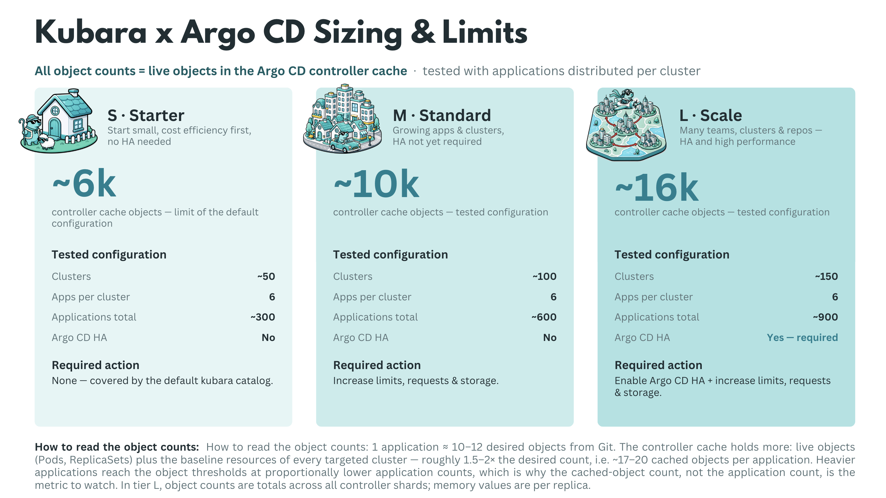

# Scale and High Availability

## How far can kubara scale, and how many clusters can kubara handle?

This is one of the questions we have received several times from the community. To answer it, we ran scale tests with up to 1,000 vclusters and used the results to define practical sizing guidelines for kubara users.

The key question is not simply how many clusters or applications a single hub can manage. What matters more in practice is how many cached objects one hub can handle before resource limits need to be increased or an HA setup becomes necessary.

To make this easier to understand, we created the simplified view below. kubara currently relies on Argo CD as its GitOps engine, which means that kubara fleet management scales as far as Argo CD can scale. However, Argo CD is not the only component that needs to be considered. Platform components bootstrapped through kubara also need to be sized accordingly.

## Overview

As the test results show, the limiting factor is not the number of vclusters or applications by itself. vclusters or k8s clusters in general do not add much weight to Argo CD, as they are represented as Secrets and do not create significant load on their own. Applications, however, can vary significantly in size. A small nginx deployment creates very little load, while something like `kube-prometheus-stack` creates many Kubernetes objects. For that reason, judging scalability only by the number of clusters or applications is misleading.

The relationship between clusters and applications is important, and it is not linear. Running 50 applications on one cluster is not the same as running 50 applications across 50 cluster, because more metadata and more live-state data needs to be cached. For our tests, we used six applications per cluster to create a balanced and realistic weighting.

Based on this assumption, we found that the number of cached objects in the Argo CD Application Controller matters more than the number of clusters or applications alone. This document does not refer to Kubernetes objects stored in etcd, but to objects cached by the Argo CD Application Controller. The following three t-shirt sizes should give you a sense of kubara’s scaling boundaries and when resource limits or HA mode should be considered.

## Argo CD Sizing – Component Configuration per T-Shirt size

!!! note

    These tests were performed with kubara versions `0.7.0` and `0.8.0`, Argo CD versions `v3.3.7` and `v3.3.9`, and STACKIT Kubernetes Engine (SKE) version `1.35.4` between May and June 2026. Baseline sizing without hydration and without fine-tuning.

| Component                     | Parameter                | S – Starter   | M – Standard | L – Large    |
| ----------------------------- | ------------------------ | ------------- | ------------ | ------------ |
| **Argo CD (overall)**         | HA mode                  | No            | No           | **Yes**      |
|                               | Cache objects (tested)   | ~6k           | ~10k         | ~16k         |
| **Application Controller**    | Replicas                 | 1             | 1            | 3 (sharding) |
|                               | CPU (request / limit)    | 250m / -      | 1 / -        | 4 / -        |
|                               | Memory (request / limit) | 2Gi / 2Gi     | 8Gi / 16Gi   | 16Gi / 32Gi  |
| **Repo Server**               | Replicas                 | 1             | 1            | 3            |
|                               | CPU (request / limit)    | 250m / -      | 500m / -     | 1 / -        |
|                               | Memory (request / limit) | 1Gi / 1Gi     | 2Gi / 4Gi    | 4Gi / 16Gi   |
| **Server (API/UI)**           | Replicas                 | 1             | 1            | 3            |
|                               | CPU (request / limit)    | 100m / -      | 250m / -     | 500m / -     |
|                               | Memory (request / limit) | 512Mi / 512Mi | 512Mi / 2Gi  | 512Mi / 2Gi  |
| **Redis**                     | Mode / Replicas          | 1             | 1            | 3 (Redis HA) |
|                               | CPU (request / limit)    | 100m / -      | 250m / -     | 500m / -     |
|                               | Memory (request / limit) | 256Mi / 256Mi | 512Mi / 2Gi  | 4Gi / 8Gi    |
| **ApplicationSet Controller** | Replicas                 | 1             | 1            | 2            |
|                               | CPU (request / limit)    | 100m / -      | 250m / -     | 500m / -     |
|                               | Memory (request / limit) | 512Mi / 512Mi | 512Mi / 1Gi  | 2Gi / 4Gi    |

When moving from S to M or L, Argo CD should not be scaled in isolation. From M onward, platform components such as Kyverno, cert-manager, and others should be reviewed and scaled together with Argo CD.

This sizing is the no-fine-tuning baseline. It should make clear which resources start to matter when kubara, Argo CD, and the platform components are scaled together.

After this baseline is understood, Argo CD can be tuned further. The options below are the most important levers we used to improve scaling behavior and reduce avoidable pressure on the controller, repo-server, Redis, and Kubernetes API.

!!! note

    HA is not just about replicas; it also requires anti-affinity, PodDisruptionBudgets, topology spread constraints, and failure-domain aware placement.*

---

## Fine-tuning Argo CD for scale

**Extend the default controller-cache exclusions with [`resource.exclusions`](https://argo-cd.readthedocs.io/en/stable/operator-manual/declarative-setup/#resource-exclusioninclusion):**

Since Argo CD 3.0, Argo CD ships default resource exclusions for several frequently changing or high-churn resources, including Endpoints, EndpointSlices, Leases, CertificateSigningRequests, cert-manager CertificateRequests, Kyverno reports, and Cilium resources. In Argo CD `v3.3.7` and `v3.3.9`, these defaults were already active during our tests. Additional exclusions are still useful for resource kinds Argo CD never needs to manage in a specific installation. This can further shrink the Application Controller cache, which was the main bottleneck in our scale and load tests.

**Relax the refresh rhythm with [`timeout.reconciliation`](https://argo-cd.readthedocs.io/en/stable/faq/#how-often-does-argo-cd-check-for-changes-to-my-git-or-helm-repository):**

Increase the default 180s reconciliation interval to something like 300–600s, then combine it with Git webhooks so real changes still trigger reconciliation immediately.

**Use a WET hydration strategy with rendered manifests:**

Pre-render manifests instead of asking the repo-server to run Helm or Kustomize on every refresh. In our tests, DRY rendering OOM-killed the repo-server at around 125 applications, while WET scaled much better. Argo CD's [Source Hydrator](https://argo-cd.readthedocs.io/en/stable/user-guide/source-hydrator/) can automate this pattern.

**Keep deployment repositories small and their history short:**

Argo CD does not provide a native shallow-clone or partial-clone switch for the repo-server. The repo-server keeps local full repository clones for manifest generation, so repository size and history directly translate into repo-server memory, disk usage, and initial-clone latency. Avoid large monorepo histories where possible, and keep deployment repositories focused.

**Give controller shards enough worker capacity:**

Raise `controller.status.processors`, `controller.operation.processors`, and `controller.kubectl.parallelism.limit` so a shard can use the CPU assigned to it. The Argo CD [application-controller HA guidance](https://argo-cd.readthedocs.io/en/stable/operator-manual/high_availability/#argocd-application-controller) documents these knobs. A useful starting point for large tests is roughly 50 status processors and 25 operation processors per 1,000 applications.

**Review [`controller.sharding.algorithm`](https://argo-cd.readthedocs.io/en/stable/operator-manual/high_availability/#argocd-application-controller) carefully:**

Moving away from `legacy` UID-hash sharding can distribute clusters more evenly across controller shards. However, `round-robin` and `consistent-hashing` are still marked as experimental in the official Argo CD documentation. They can be useful in scale tests and selected production environments, but the operational caveat should be documented and understood before relying on them.

**Extend the default [`resource.customizations.ignoreResourceUpdates`](https://argo-cd.readthedocs.io/en/stable/operator-manual/reconcile/) rules for noisy update churn:**

Since Argo CD 3.0, default ignore rules are already shipped in `argocd-cm`, and `.status` updates for watched resources are ignored by default. In Argo CD `v3.3.7` and `v3.3.9`, these defaults were already active during our tests. Additional rules can still help when specific controllers create irrelevant update noise, for example through `kubectl.kubernetes.io/last-applied-configuration` or custom status fields from Kyverno, External Secrets, or other operators.

**Limit monorepo blast radius with [`argocd.argoproj.io/manifest-generate-paths`](https://argo-cd.readthedocs.io/en/stable/operator-manual/high_availability/#monorepo-scaling-considerations):**

Annotate Applications with their source paths so one commit only re-renders affected applications instead of every application in the repository.

**Protect repo-server memory with [`reposerver.parallelism.limit`](https://argo-cd.readthedocs.io/en/stable/operator-manual/high_availability/#argocd-repo-server):**

Cap concurrent manifest generations per repo-server replica and tune `--repo-cache-expiration` so redundant rendering does not create avoidable memory spikes.

**Reduce Redis pressure with [`ARGOCD_APPLICATION_TREE_SHARD_SIZE`](https://argo-cd.readthedocs.io/en/stable/operator-manual/high_availability/#argocd-application-controller):**

Split large application trees across multiple Redis keys. A useful starting value is `100`; the default is `0`, which disables application-tree sharding. Also verify that `redis.compression` is set to `gzip`, which is the default, rather than treating compression as a separate feature that needs to be enabled.

**Raise Kubernetes client limits deliberately:**

Tune `ARGOCD_K8S_CLIENT_QPS` and `ARGOCD_K8S_CLIENT_BURST` as described in the Argo CD [application-controller scaling guidance](https://argo-cd.readthedocs.io/en/stable/operator-manual/high_availability/#argocd-application-controller). Otherwise, controller shards managing many clusters can be throttled by their own Kubernetes client.

**Smooth cluster-cache rebuilds:**

Tune `ARGOCD_CLUSTER_CACHE_LIST_PAGE_SIZE` and `ARGOCD_CLUSTER_CACHE_LIST_SEMAPHORE` using the Argo CD [cluster-cache recommendations](https://argo-cd.readthedocs.io/en/stable/operator-manual/high_availability/#argocd-application-controller) to reduce memory spikes during startup and cache resyncs across many clusters.

**Prefer [server-side diff](https://argo-cd.readthedocs.io/en/stable/user-guide/diff-strategies/) for diff-heavy workloads:**

Offload diff calculation to the target cluster's API server where it helps, especially when mutating webhooks create noisy diffs.

**Add [`timeout.reconciliation.jitter`](https://argo-cd.readthedocs.io/en/stable/operator-manual/high_availability/#argocd-application-controller):**

Spread refreshes over time so all Applications do not wake up in one synchronized wave after each interval.

**Consider replacing the Redis cache with Dragonfly (untested in our runs):**

Argo CD uses Redis only as a non-critical cache. If it fails, reconciliation continues, but refreshes slow down until the cache is rebuilt. Within our tested range, Redis was never the bottleneck. At larger scale, however, Redis HA can require overprovisioning or cause performance cliffs during mass syncs and refreshes. Replication lag and slow failover can also affect cache consistency, as described in the [Akuity case study](https://www.dragonflydb.io/blog/akuity-argocd-dragonfly-case-study). [Dragonfly](https://www.dragonflydb.io/) is a multi-threaded, Redis-compatible store that scales vertically with CPU cores and can replace the 6-pod Redis HA and HAProxy stack via its operator without touching Argo CD internals. See also the [KubeCon NA 2025 talk](https://kccncna2025.sched.com/event/27Ff2/turbocharging-argo-cd-replacing-redis-with-dragonfly-for-better-performance-and-lower-bills-soumya-ghosh-dastidar-justin-marquis-akuity-inc). Dragonfly is not officially supported by the Argo CD project.

**“HA” does not mean automatic failover for the Application Controller.**

Controller replicas act as shards, and each shard is a singleton for its assigned clusters. If a shard pod fails, those clusters are not reconciled until the pod restarts and rebuilds its cluster cache. At L-tier object counts, cache rebuild time usually dominates recovery. Argo CD’s [dynamic cluster distribution](https://argo-cd.readthedocs.io/en/stable/operator-manual/dynamic-cluster-distribution/) feature, currently alpha, can redistribute clusters from a failed shard to the remaining ones. Until then, treat controller “HA” as capacity scaling plus faster recovery, not full fault tolerance. Also document a break-glass procedure, such as `kubectl apply` outside the GitOps flow, because a broken Argo CD cannot repair itself.
