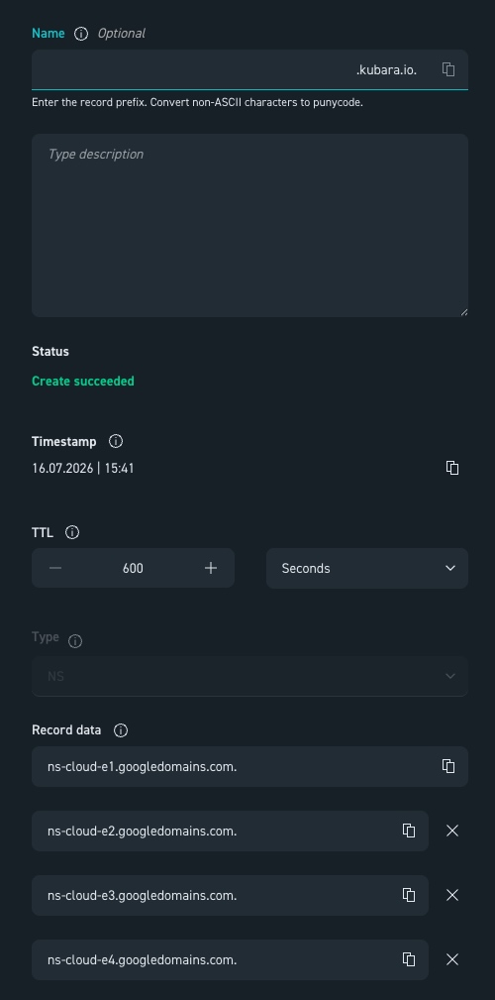

# Kubara on Google Cloud

If you want to run kubara on a hyperscaler like Google Cloud, there are specific configurations to apply. Here we provide an example that can be conveniently adapted to other major cloud providers.

In this example we use provider-native components: 
* Google Secret Manager for External Secrets
* Google DNS with a delegated subdomain (from any domain registrar that allows setting NS records).
* Google Kubernetes Engine (GKE) as managed Kubernetes

For any other setup, please check the corresponding component's own documentation.

And feel free to contribute! :)  

We assume you're starting from an empty Google Cloud Project to test kubara, and that you've already made yourself familiar with the [kubara deployment guide](../1_getting_started/bootstrapping.md). Please do that first if you haven't yet.

!!! note "Before you start"
    1. GKE **Autopilot** isn't compatible with the privileges `kube-prometheus-stack` needs (its `node-exporter` requires host access that Autopilot blocks), so this guide uses **Standard** mode instead — see the cluster-creation parameters below.
    2. Velero on GCP hasn't been tested as part of this guide — please follow the [official Velero project docs](https://github.com/velero-io/velero-plugin-for-gcp#setup) instead.
    3. Google Cloud was formerly known as GCP "Google Cloud Platform", so this term will be seen often in this guide because of the former name.


## Local Prerequisites

Before starting, the [gcloud CLI](https://cloud.google.com/sdk/docs/install) is required, along with an already authenticated account (`gcloud auth login`) with access to the target Google Cloud Project.

You'll also need kubara installed. See the [Installation guide](../1_getting_started/installation.md).

## TL;DR / Sneak preview:

1. We will generate an `.env` file and configure all necessary values, after that generate the config.yaml and fill it out too. `kubara init (--prep)`
Then we will generate all the rendered Helm-Charts: `kubara generate`

2. We will create and configure a GKE Cluster, set up Google Secret Manager, configure Google DNS with an existing domain by delegating a subdomain for ExternalDNS and set up SSO.

3. We will create, check and adapt the following values files:

All paths below are relative to the `platform-configs` directory that `kubara generate` writes for you. We'll check and adapt the following Helm values files:

- `platform-configs/<my-cluster>/helm/argo-cd/values-gcp.yaml`
- `platform-configs/<my-cluster>/helm/external-dns/values-gcp.yaml`
- `platform-configs/<my-cluster>/helm/external-secrets/values-gcp.yaml`
- `platform-configs/<my-cluster>/helm/kube-prometheus-stack/values-gcp.yaml`
- `platform-configs/<my-cluster>/helm/oauth2-proxy/values-gcp.yaml`

4. We will then create our necessary secrets and deploy kubara on GKE. `kubara bootstrap <my-cluster>`
  

## Part 1: Preparing the Google Cloud deployment

Let's get started with the actual setup!

```bash
# Install gke-gcloud-auth-plugin – required so kubectl can authenticate against the GKE cluster
gcloud components install gke-gcloud-auth-plugin

# Set the project
gcloud config set project [YOUR-PROJECT-NAME]
```

Follow the kubara [Bootstrapping Guide](../1_getting_started/bootstrapping.md), generate your helm charts and stop before bootstrapping [Step 4: Bootstrapping](../1_getting_started/bootstrapping.md#4-deploying-argo-cd). The bootstrapping will be handled as part of this page.


```bash
# pseudo-workflow, please check the up2date official guide!

kubara init --prep # generate .env file & set values accordingly
kubara init # generate config.yaml & set values accordingly
kubara generate # generate helm charts

# Stop after generating your Charts and proceed with: 
# "Part 2: Google Cloud Infrastructure"
```
  

## Part 2: Google Cloud Infrastructure

### Enable Secret Manager

External DNS needs a secret store. As mentioned above, the platform-native Google Secret Manager is the natural choice. First, enable the corresponding API:

```bash
gcloud services enable secretmanager.googleapis.com
```

### Choose or Create a Network

Deploying Google Kubernetes Engine (GKE) requires a network (VPC). Existing networks can be checked as follows:

```bash
## check for existing networks/VPC
gcloud compute networks list
```

If no suitable network exists, one can be created from scratch, including a router, a subnet (with secondary ranges for pods/services), and Cloud NAT. 

!!! note "Optional: Example how to create a new network, router, subnet & Cloud NAT"
    
    Please be careful and adapt these commands to your needs before applying:

    ```bash title="Optional Network component creation"
    ## OPTIONAL: create network & nat router
    gcloud compute networks create test-network --subnet-mode=auto

    ## router
    gcloud compute routers create test-router \
        --network=test-network \
        --region=europe-west3

    ## subnet
    gcloud compute networks subnets create test-subnet \
        --network=test-network \
        --region=europe-west3 \
        --range=10.0.0.0/24 \
        --secondary-range=pods=10.4.0.0/14,services=10.8.0.0/20

    ## cloud nat
    gcloud compute routers nats create test-nat \
        --router=test-router \
        --region=europe-west3 \
        --auto-allocate-nat-external-ips \
        --nat-all-subnet-ip-ranges
    ```
  

### Create the GKE Cluster

```bash
gcloud container clusters create test-cluster \
    --zone=europe-west3-a \                # Zonal cluster (single availability zone for testing)
    --network=test-network \                # VPC network the cluster is deployed into
    --subnetwork=test-subnet \              # Subnet within that network (incl. pod/service ranges)
    --enable-private-nodes \                # Nodes only get internal IPs, no public IP (more secure)
    --enable-ip-alias \                     # Enable VPC-native networking (required for private nodes & alias IP ranges)
    --master-ipv4-cidr=172.16.0.0/28 \      # Private IP range for the GKE control plane (must not overlap with anything else)
    --release-channel=regular \             # Update channel for automatic cluster upgrades (regular = balance between stability and new features)
    --machine-type=e2-standard-4 \          # VM type for worker nodes (4 vCPUs, 16 GB RAM)
    --num-nodes=1 \                         # Number of nodes at startup (per zone)
    --enable-autoscaling --min-nodes=0 --max-nodes=3 \  # Cluster autoscaler: scales automatically between 0 and 3 nodes
    --spot \                                # Uses cheap Spot VMs (can be reclaimed by the provider at any time – not suitable for critical workloads without tolerations)
    --disk-size=30 \                        # Boot disk size per node in GB
    --workload-pool=$(gcloud config get-value project).svc.id.goog \  # Enables Workload Identity: Kubernetes ServiceAccounts can securely impersonate GCP IAM service accounts, with no key files at all
    --async                                 # Command returns immediately without waiting for cluster creation to finish
```

#### Restrict Control Plane / API Access to Your Own IP

`--enable-master-authorized-networks` only allows explicitly permitted IP ranges to reach the Kubernetes API. Following the principle of least privilege. For test purposes, your own public IP is enough; in a production environment, you would instead enter fixed CIDR ranges for bastion hosts, VPNs, CI/CD runners, etc. 

```bash
## Restrict control plane / API access to your own IP:
gcloud container clusters update test-cluster \
    --zone=europe-west3-a \
    --enable-master-authorized-networks \                  # Restricts access to the control plane API to an allowlist of IP ranges
    --master-authorized-networks=$(curl -s ifconfig.me)/32 # Adds only your own public IP (as a /32, so exactly one address) to that allowlist
```
  

#### Wait for the Cluster & Check the Connection

```bash
## Wait until the cluster is ready (status: RUNNING)
gcloud container clusters list                                    # Lists all clusters in the project including their current status

## Generate credentials (kubeconfig) for the cluster
gcloud container clusters get-credentials test-cluster \
    --region=europe-west3-a                                       # Writes connection details for test-cluster into the local kubeconfig, so kubectl can access it

## Check the connection
kubectl get ns                                                     # Lists all namespaces in the cluster – fails if the connection/auth is broken
```
  

## Part 3: The Platform

#### OAuth2 Configuration

How exactly these configurations are done depends on the chosen SSO provider (examples see the [SSO guide](../4_building_your_platform/sso/add_sso.md) for details). Regardless of the provider, however, at least the following SSO apps must be created for SSO:

1. Argo CD SSO
2. Grafana SSO
3. OAuth2 Proxy SSO

The resulting credentials are added manually later, in the [Create Secrets](#create-secrets) section. So save them for later.
  
!!! note "Workload Identity"
    We use workload identitys in these examples.
    Workload Identity binds a GCP service account directly and keylessly to a Kubernetes ServiceAccount. Pods then authenticate against GCP APIs transparently through that binding, with finely scoped IAM roles per use case — with no secret material to manage or rotate at all. (See: https://docs.cloud.google.com/iam/docs/workload-identities)
  
  
  
### external-DNS with Google DNS

```bash title="External DNS Configuration for Google Cloud"
# Create a service account for ExternalDNS
gcloud iam service-accounts create external-dns-sa \
    --display-name="SA for GKE ExternalDNS"

# Grant the service account write permissions on Cloud DNS
gcloud projects add-iam-policy-binding $(gcloud config get-value project) \
    --member="serviceAccount:external-dns-sa@$(gcloud config get-value project).iam.gserviceaccount.com" \
    --role="roles/dns.admin"

# Bind Workload Identity (note: requires the matching namespace – kubara's default is the chart name, so "external-dns" here)
gcloud iam service-accounts add-iam-policy-binding external-dns-sa@$(gcloud config get-value project).iam.gserviceaccount.com \
    --role="roles/iam.workloadIdentityUser" \
    --member="serviceAccount:$(gcloud config get-value project).svc.id.goog[external-dns/external-dns-sa]"

# Create the Google Cloud managed DNS zone
gcloud dns managed-zones create kubara-gcp-zone \
    --dns-name="subdomain.your-domain.com." \
    --description="Subdomain Zone for GKE kubara" \
    --visibility=public

# Print the zone's nameservers – these are then entered at the domain registrar as a delegated subdomain
gcloud dns managed-zones describe kubara-gcp-zone --format="value(nameServers)"
```

DNS example:




Next, the `values.yaml` for external-dns needs to be adjusted.

```yaml title="../platform-configs/<my-cluster>/helm/external-dns/values-gcp.yaml"
# set project id in service account annotation
external-dns:
  provider: google
  google:
    project: "<your-google-cloud-project-id>" # your project
  domainFilters:
    - "subdomain.your-domain.com" # your zone
  serviceAccount:
    create: true
    name: external-dns-sa
    annotations:
      iam.gke.io/gcp-service-account: "external-dns-sa@<your-gcp-project-id>.iam.gserviceaccount.com" # replace with your service account
```
  

### External Secrets

```yaml title="Configure GCP for External Secrets"
# 1. Create a Google service account
gcloud iam service-accounts create external-secrets-sa \
    --display-name="GKE Kubara External Secrets SA"
  
# 2. Grant the service account permission to read secrets (Secret Accessor)
gcloud projects add-iam-policy-binding $(gcloud config get-value project) \
    --member="serviceAccount:external-secrets-sa@$(gcloud config get-value project).iam.gserviceaccount.com" \
    --role="roles/secretmanager.secretAccessor"

# 3. Link the Kubernetes ServiceAccount via Workload Identity
gcloud iam service-accounts add-iam-policy-binding external-secrets-sa@$(gcloud config get-value project).iam.gserviceaccount.com \
    --role="roles/iam.workloadIdentityUser" \
    --member="serviceAccount:$(gcloud config get-value project).svc.id.goog[external-secrets/external-secrets-sa]"
```
 
```yaml title="../platform-configs/<my-cluster>/helm/external-secrets/values-gcp.yaml"
external-secrets:
  serviceAccount:
    create: true
    # exact same name as the GCP service account you created in the previous step
    name: "external-secrets-sa"
    annotations:
      # associate the Kubernetes service account with the GCP service account
      iam.gke.io/gcp-service-account: "external-secrets-sa@google-project-xyz-0abc.iam.gserviceaccount.com" # replace with your service account
```


#### SecretStore

Create a secretstore.yaml, use this template and change your Project ID:

```yaml title="secretstore.yaml"
apiVersion: external-secrets.io/v1
kind: SecretStore
metadata:
  name: gcp-store
  namespace: external-secrets
spec:
  provider:
    gcpsm:
      projectID: $YOUR-GOOGLE-CLOUD-PROJECT-ID # replace with your project ID
```

!!! warning
    Before `kubectl apply -f secretstore.yaml` can be run, the corresponding CRDs need to be installed first. This is handled automatically by the `kubara bootstrap` command later, so don't try to apply it now.

#### Create Secrets

Now all secrets required by kubara are created. The commands below are just one proven example — secrets can just as well be created another way, as long as the name and content match.

!!! warning "Naming convention"
    Replace every secret name below to match your cluster name and stage from `config.yaml`, using the pattern `<cluster>-<stage>-...`. Example: Given your cluster is called "cthulhu" and the stage is called "dev", the following docker-config secret would be called cthulhu-dev-cluster-secrets-docker-config. 

    Also don't forget to replace the values in the secret command, like for example "$YOUR_COOKIE_SECRET_CREATED_ABOVE".
    
    In this example it is called gcp-dev (name: gcp, stage: dev), so be careful to replace all names and set the values!


```bash title="Docker Pull Secret"
gcloud secrets create gcp-dev-cluster-secrets-docker-config --replication-policy=automatic # replace name of the secret according to your name and stage / replace "gcp-dev"
# Decode the base64-encoded Docker pull secret and store it as JSON field "pull-secret" in Secret Manager
# change name of the secret according to your name and stage / replace "gcp-dev" & replace secret values accordingly
printf '%s' '$YOUR_PASSWORD_IN_BASE64' | base64 -d | jq -Rs '{"pull-secret":.}' | gcloud secrets versions add gcp-dev-cluster-secrets-docker-config --data-file=- 

```


```bash title="Grafana Admin Secret"
gcloud secrets create gcp-dev-kube-prometheus-stack-grafana-credentials --replication-policy=automatic # replace name of the secret according to your name and stage / replace "gcp-dev"
# replace name of the secret according to your name and stage / replace "gcp-dev" & replace secret values accordingly
printf '%s' '{"admin-user":"admin","admin-password":"$YOUR_PASSWORD"}' | gcloud secrets versions add gcp-dev-kube-prometheus-stack-grafana-credentials --data-file=- 
```


```bash title="Grafana SSO Secret"
# replace name of the secret according to your name and stage / replace "gcp-dev"
gcloud secrets create gcp-dev-kube-prometheus-stack-grafana-oauth2-credentials --replication-policy=automatic 

 # replace name of the secret according to your name and stage / replace "gcp-dev" & replace secret values accordingly
printf '%s' '{"client-id":"$YOUR_GRAFANA_CLIENT_ID","client-secret":"$YOUR_SECRET"}' | gcloud secrets versions add gcp-dev-kube-prometheus-stack-grafana-oauth2-credentials --data-file=-
```


```bash title="OAuth2 Proxy Secret"
# replace name of the secret according to your name and stage / replace "gcp-dev"
gcloud secrets create gcp-dev-oauth2-proxy-oauth2-credentials --replication-policy=automatic 

# Generate the cookie secret locally (see https://oauth2-proxy.github.io/oauth2-proxy/configuration/overview/)
dd if=/dev/urandom bs=32 count=1 2>/dev/null | base64 | tr -d -- '\n' | tr -- '+/' '-_' ; echo

# replace name of the secret according to your name and stage / replace "gcp-dev" & replace secret values accordingly
printf '%s' '{"client-id":"$YOUR_OAUTH2_CLIENT_ID","client-secret":"$YOUR_SECRET","cookie-secret":"$YOUR_COOKIE_SECRET_CREATED_ABOVE"}' | gcloud secrets versions add gcp-dev-oauth2-proxy-oauth2-credentials --data-file=- 
```


```bash title="ArgoCD SSO Secret"
# replace name of the secret according to your name and stage / replace "gcp-dev"
gcloud secrets create gcp-dev-argocd-argo-oauth2-credentials --replication-policy=automatic 

# replace name of the secret according to your name and stage / replace "gcp-dev" & replace secret values accordingly
printf '%s' '{"client-id":"$YOUR_ARGO_CLIENT_ID","client-secret":"$YOUR_SECRET"}' | gcloud secrets versions add gcp-dev-argocd-argo-oauth2-credentials --data-file=- 
```

!!! warning "Before you copy these over"
    - Place each snippet below at its matching path under `platform-configs/<my-cluster>/helm/...`.
    - This example uses `gcp` as the cluster name — double-check your own path if it differs.
    - Replace every secret name to match the cluster name and stage defined in your `config.yaml` 
    (see the naming convention above).


```yaml title="platform-configs/<my-cluster>/helm/argo-cd/values-gcp.yaml"
argo-cd:  
  bootstrapValues:
    dockerPullSecrets:
      image-pull-secret:
        remoteRef:
          remoteKey: gcp-dev-cluster-secrets-docker-config # change name according to your config.yaml (format: $clustername-$stage)

externalSecrets:
  secrets:
    oauth2-credentials:
      dataFrom:
        - remoteKey: gcp-dev-argocd-argo-oauth2-credentials # change name according to your config.yaml (format: $clustername-$stage)
```

```yaml title="platform-configs/<my-cluster>/helm/kube-prometheus-stack/values-gcp.yaml" 
externalSecrets:
  secrets:
    grafana-admin-credentials:
      dataFrom:
        - remoteKey: gcp-dev-kube-prometheus-stack-grafana-credentials # change name of the secret according to your name and stage / replace "gcp-dev"
    oauth2-credentials:
      dataFrom:
        - remoteKey: gcp-dev-kube-prometheus-stack-grafana-oauth2-credentials # change name of the secret according to your name and stage / replace "gcp-dev"
```

```yaml title="platform-configs/<my-cluster>/helm/oauth2-proxy/values-gcp.yaml"
externalSecrets:
  secrets:
    oauth2-credentials:
      dataFrom:
        - remoteKey: gcp-dev-oauth2-proxy-oauth2-credentials # change name of the secret according to your name and stage / replace "gcp-dev"
```


#### Velero
If you want to use Velero see: https://github.com/velero-io/velero-plugin-for-gcp#setup  
Please refer to the official velero docs - feel free to contribute if you have some proposal to enhance this Google Cloud example.


## Part 4: Apply the SecretStore & Bootstrap Kubara

The `Secretstore` can be passed directly into the bootstrap process instead of applying via kubectl (just adjust the path/filename in `--with-es-css-file` if it differs):

```bash title="kubara bootstrap"
kubara bootstrap gcp \
  --with-es-css-file secretstore.yaml \
  --with-es-crds --with-prometheus-crds
```

Now you should have a successfully deployed kubara installation.
Wait some minutes and check if all helm charts are synced and green.
Enjoy!